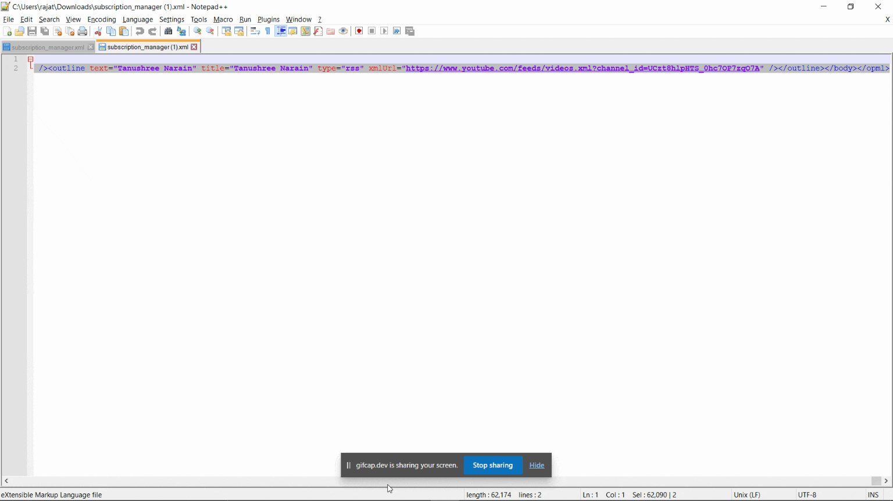
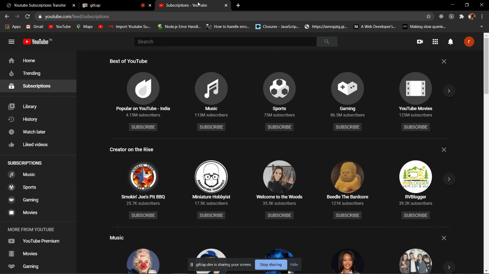

# Youtube Subscriptions Copier
> Transfer your youtube channel subscriptions from one youtube account to another without much hassle.

Did you ever create a new Youtube account but all your favourite channels you subscribed to over the years are in your previous account and now you have to search for all the channels again and subscribe to them manually which is very tedious if you have hundreds of channels in your previous account.

This Website will transfer your subscriptions from previous account to new account,just follow the instructions  and you will have all your channels in your new account in no time.

## How to Copy channels?? 

1.First of all login to your previous youtube account from which you want to copy your subscriptions and while logged in go to -
> https://www.youtube.com/subscription_manager

2.Then go to Export Subscriptions on bottom of page,this will create a file containing all your subscribed channels information.Download the file.

3.Now,open the file downloaded and copy all its contents.

4.Now,Go to this link - <a href="./generate_code.html" target="_blank">YOUTUBE SUBSCRIPTIONS COPIER</a>

5.Paste all the text you copied in step 3 to the left side text box and click on export channels.

6.A Script will be generated in the right side text box.

7.Now,Go to google chrome and login to the target youtube account to which you want to copy your subscriptions.

8.Now ,in Google Chrome,go to this link and add this extension to chrome - <a href="https://chrome.google.com/webstore/detail/custom-javascript-for-web/ddbjnfjiigjmcpcpkmhogomapikjbjdk" target="_blank">Custom JavaScript for Websites 2</a>

9.Now,go to the same tab as step 4 in which we generated the script,copy all the contents of right side text box.

10.Open the extension added to chrome in step 8 and copy the text copied in step 9 in the window of the extension,then click on the save button above.

11. As soon as you click on save,chrome will start subscribing to all the channels you had in previous account for you.

12.Let it run until it stops loading.

13.Voila,all your subscriptions have been copied!!!

14.When completed,delete the text copied from extension or remove the extension,otherwise,it will keep trying to subscribe every time you open youtube.

---

 
 
Distributed under the MIT license. 

## Contributing

1. Fork it (<https://github.com/yourname/yourproject/fork>)
2. Create your feature branch (`git checkout -b feature/fooBar`)
3. Commit your changes (`git commit -am 'Add some fooBar'`)
4. Push to the branch (`git push origin feature/fooBar`)
5. Create a new Pull Request

<!-- Markdown link & img dfn's -->
[npm-image]: https://img.shields.io/npm/v/datadog-metrics.svg?style=flat-square
